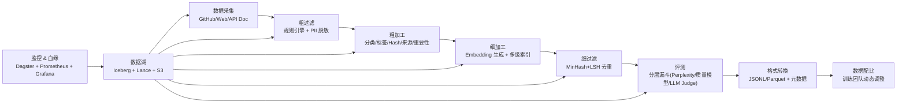

# 基座模型训练数据链路方案设计 v1.0

## 1. 总体方案概览

本方案为 70B 参数基座模型的预训练数据链路提供完整技术设计，覆盖数据采集、存储、加工、去重、评测、配比和格式转换全流程。数据规模 100PB-EB 级别，增量约每天 TB 级。

### 1.1 核心设计原则

- **效率优先**：第一阶段以高召回、低计算成本为目标，快速建立可用数据索引
- **渐进式精炼**：多轮迭代处理（粗过滤 → 粗加工 → 细加工 → 细过滤 → 评测），逐级提升数据质量
- **元数据不膨胀**：embedding 控制在 1-2 个/数据项，分类/tag 控制在 10 个以内
- **全链路可追溯**：从模型 checkpoint → 数据集 → 处理阶段 → 原始 URL 的完整血缘

### 1.2 全链路架构总览



## 2. 数据源矩阵

| 数据源 | 采集策略 | 处理重点 | 预期产出 |
|---|---|---|---|
| **GitHub 代码** | 静态快照（全量）+ 演进式挖掘（精选 repo） | AST 解析过滤、License 识别、PII 脱敏 | 代码语料 + SWE-bench 风格修复数据集 |
| **网页文档** | 定向深挖（核心文档站）+ 通用抓取（广撒网），隔离处理 | HTML → 文本提取 → 语言检测 → 质量过滤 | 多语言文档语料 |
| **API 文档** | 定向深挖（Swagger/OpenAPI/ReadTheDocs/MDN） | 结构化提取 + 与代码使用的对齐关联 | API 文档语料 + (api_doc, code_usage) 关联 |
| **GitHub Issue/PR/Discussion** | GitHub Archive + API | 模板过滤、bot 内容过滤 | 自然语言对话语料 |

## 3. 数据湖架构

### 3.1 存储格式：Iceberg + Lance + S3

- **Lance**：列式存储格式，原生支持向量索引（IVF-PQ/DiskANN），在存储层直接做 ANN 检索
- **Iceberg**：表格式管理，提供 snapshot 隔离、time travel 和增量数据管理
- **S3**：底层对象存储

### 3.2 增量数据策略

- 热数据（近 30 天）：追加式写入（Append-only）
- 冷数据（> 30 天）：定期 Compaction 合并小文件、重建局部索引
- 去重延迟：允许天级延迟，不要求实时去重
- 元数据统一：Iceberg snapshot 管理，多表可通过 snapshot ID 关联

### 3.3 数据版本化与血缘追踪

基于 Iceberg snapshot 的全链路血缘：

```
原始 URL → 采集 snapshot → 粗过滤 snapshot → 粗加工 snapshot 
→ Embedding snapshot → 去重 snapshot → 评测 snapshot → 训练数据集 snapshot
```

每个 snapshot 的 metadata 中嵌入：
- Pipeline 版本号
- 处理参数（去重阈值、过滤规则版本、embedding 模型版本）
- 数据指纹（SHA256）

需与训练团队的实验管理系统（W&B / MLflow）打通，实现从模型 checkpoint 回溯到原始数据 URL。

## 4. 全链路处理阶段

### 4.1 阶段一：数据采集

| 子模块 | 技术方案 | 备注 |
|---|---|---|
| GitHub 静态快照 | GitHub Archive + API，下载 repo 文件树 | 全量覆盖 |
| GitHub 演进式挖掘 | 追踪 commit 历史，分析 diff，关联 Issue/PR | 仅精选高质量 repo |
| 网页定向深挖 | 预设种子 URL（技术博客、官方文档、论坛）深度遍历 | 隔离处理 |
| 网页通用抓取 | 按域名广度优先 | 与定向抓取隔离 |
| API 文档采集 | Swagger/OpenAPI/ReadTheDocs/MDN 定向 | 结构化提取 |

### 4.2 阶段二：粗过滤（规则引擎）

**纯规则引擎，不做 ML 推理。**

| 过滤规则 | 代码数据 | 文档/网页数据 |
|---|---|---|
| 格式错误 | AST 解析成功率 < 阈值（Tree-sitter Top-15 语言） | HTML 解析后有效文本占比 < 10% |
| 明显重复 | SHA256 精确哈希去重（全量，级联过滤第一层） | 同左 |
| 低质量不可读 | 函数体过于简短/无意义、注释密度极低、自动生成代码 | 正文 token < 100、导航页/登录页、纯广告页 |
| PII 脱敏 | 正则 + NER：API key/密码/token/邮箱/手机号 | 同左 |

**代码语言覆盖策略**：
- Top-15 语言：Python/JS/TS/Java/Go/C/C++/Rust/Ruby/PHP/C#/Swift/Kotlin/Scala/Lua → 完整 AST 解析
- 其余语言：纯文本处理，后续按需补充 AST

### 4.3 阶段三：粗加工

元数据字段：

| 字段 | 类型 | 说明 |
|---|---|---|
| `source` | enum | github / web_crawl / api_doc / curated |
| `content_type` | enum | code / natural_text / structured / mixed |
| `lang` | enum | zh / en / multilingual / code |
| `quality_level` | enum（可置空） | raw / filtered / high_potential（粗加工后填充） |
| `importance` | float（可置空） | 来源权威分 × 内容密度分，0-1 |
| `hash` | string | SHA256 |
| `license` | string（可置空） | MIT/Apache/GPL/... |
| `char_length` | int | 原文长度 |
| `token_count` | int | token 数估算 |
| `url` | string | 原始来源 URL |

**Tag 体系**：多标签多维度，控制在 10 个以内，具体维度后续与训练团队确定。

### 4.4 阶段四：细加工（Embedding 生成）

**多级索引架构**（B：先按来源/类型/语言分簇，每个簇内独立建 ANN 索引）：

- 第一阶段：轻量模型（384d，如 all-MiniLM-L6-v2），高召回，快速建立可用索引
- 第二阶段：中等质量模型（768d/1024d，如 BGE-base/E5-base），对高价值子集精编码
- 代码数据：独立处理，可选用专用模型（UniXcoder/StarCoder-Embed）

**Embedding 数量**：每数据项 1-2 个（content_embedding + 可选 summary_embedding）

**Embedding 生成框架**：Ray（GPU 批处理推理）

### 4.5 阶段五：细过滤（去重）

三层级联去重：

```
第1层：精确哈希（SHA256）→ 全量
第2层：MinHash + LSH → 文档/网页类，Jaccard 阈值 0.8+
第3层：Embedding 语义去重 → 仅高价值数据配比阶段做
```

去重粒度：**文档级别**（粗粒度，整篇 README/整个 Issue/整个 PR 描述）。

### 4.6 阶段六：数据评测

**分层漏斗模型**（B）：

```
L1: Perplexity + 分类模型 → 全量（低成本）
    ↓ 通过 L1 的数据
L2: 文本质量模型（fine-tuned BERT/RoBERTa）→ 候选集
    ↓ 抽样
L3: LLM Judge → 校准 L1/L2 阈值（ROC 曲线自定阈值）
    ↓ 最小量
L4: 人工评估 → 最终 QA 基准锚定
```

阈值管理：数据团队用 LLM judge 抽样标注后，通过 ROC 曲线自定阈值。

### 4.7 阶段七：格式转换

- **预训练数据**：带元数据的 JSONL/Parquet（原始文本，不预 tokenize）
- **SFT 数据**：标准 instruction 格式（ChatML/ShareGPT）
- **Token 预计算**：详见附录对比表，Phase 1 不预 tokenize，待与训练团队确认后决策

### 4.8 阶段八：数据配比

- 配方形式：B（按质量分层 + 来源多维度）为主，A（按来源比例）兜底
- 训练团队动态调整配比参数
- 数据团队提供多维度元数据，训练团队自由组合

## 5. 合成数据生成

| 子模块 | 方案 | 模型 | 质量控制 |
|---|---|---|---|
| 模板生成（A） | 预定义模板填充 context，自 QA 构造 | 规则 | 数据团队自闭环 |
| LLM 开放生成（B） | 强模型读取原始数据，自主生成多样化 instruction | 内部模型 + 开源模型自部署 | LLM judge 抽样质检 |
| 双向验证（D） | B 生成后用不同模型回答对比，不一致丢弃 | 多模型交叉 | 自动 + 人工抽检 |

**质量控制**：数据团队主导自闭环，给出指标和说明，训练团队参与质检。

## 6. API 文档-代码对齐

**C → A 混合策略**：

1. **C（倒排索引）阶段**：从 API 文档提取 class/function/method 名，建倒排索引，在代码语料中 grep 匹配
2. **A（符号级对齐）阶段**：对匹配结果做 AST 验证，确认该代码确实调用了对应 API

产出格式：`(api_name, api_module, doc_text, code_snippet, repo_info)` 五元组，存入元数据作为关联关系。

## 7. GitHub 数据深度挖掘

### 7.1 Solution Extraction（B + 部分 C）

- **B（函数级提取）**：从 git diff 中 AST 提取涉及的具体函数/方法变更
- **C（Instruction-Solution Pairing）**：对高质量 commit，用 LLM 从 commit message 提取 task description

### 7.2 Verification（B + 部分 C + D 兜底）

- **B（Test 验证）**：提取 repo 测试用例，验证 fix 后通过率
- **C（LLM 验证）**：强模型判断 solution 是否解决描述的 problem
- **D（质量分兜底）**：依靠评测阶段质量分间接筛选

## 8. RLHF 数据管线

| 数据子类型 | 数据来源 | 方案 |
|---|---|---|
| SFT 数据 | 人工撰写 + 合成数据 | 合成数据生成管线（见第 5 章） |
| 偏好数据 | LLM Judge 生成 + 人工抽检 | LLM-as-Judge 为主，人工仅做仲裁和偏差校准 |
| DPO 数据 | 偏好数据格式转换 | 纯格式转换 |
| RLHF 反馈数据 | PPO 训练闭环 | 训练框架内部循环，数据团队不参与 |

标注团队：待定，暂定需要，具体人数和标注方案后续确定。

## 9. 技术选型总览

| 领域 | 选型 | 阶段 |
|---|---|---|
| 数据湖格式 | **Lance**（列式 + 原生向量索引） | Phase 1 |
| 表管理 | **Iceberg**（snapshot/增量/血缘） | Phase 1 |
| 对象存储 | **S3** | Phase 1 |
| 粗加工计算 | **Apache Spark**（CPU 密集 ETL） | Phase 1 |
| Embedding 推理 | **Ray**（GPU 批处理） | Phase 1 |
| Pipeline 编排 | **Dagster**（首选）/ **DolphinScheduler**（内部已有备选） | Phase 1 |
| 多语言 AST | **Tree-sitter**（Top-15 语言 + 长尾按需） | Phase 1 |
| 去重 1 | **SHA256** 精确哈希 | Phase 1 |
| 去重 2 | **MinHash + LSH**，Jaccard 0.8+ | Phase 1 |
| 去重 3 | **Embedding 语义去重** | Phase 2 |
| 质量评测 L1 | **Perplexity**（KenLM）+ **分类模型** | Phase 1 |
| 质量评测 L2 | **文本质量模型**（BERT/RoBERTa fine-tuned） | Phase 1 |
| 质量评测 L3 | **LLM Judge**（内部模型） | Phase 1 |
| 质量评测 L4 | **人工评估**（抽样） | Phase 1 |
| 合成数据 | 内部模型 + 开源模型自部署 | Phase 2 |
| 向量索引 | **Lance 原生 ANN**（IVF-PQ/DiskANN） | Phase 1 |
| 数据血缘 | **Iceberg snapshot + 元数据表** | Phase 1 |
| 监控 | **Prometheus + Grafana** + Dagster 内建 | Phase 1 |

### 9.1 Pipeline 编排框架对比

| 维度 | Dagster | Airflow | DolphinScheduler | Prefect | Temporal |
|---|---|---|---|---|---|
| 编程模型 | Asset-based（数据资产导向） | Task-based DAG | Task-based DAG，可视化 | Flow-based，Python-native | Workflow-as-code |
| Iceberg 集成 | **原生支持** | 需自建 | 需自建 | 需自建 | 需自建 |
| 增量调度 | **强**：asset 粒度自动检测 | 中：Sensor 轮询 | 弱：时间调度为主 | 中：event-driven | 强：Signal/Query |
| 数据血缘 | **强**：自动 asset 级 lineage | 弱：仅 task 级 | 弱：task 级 | 中：basic | 弱 |
| 运维成本 | 中 | 中高 | **低**（国内生态友好） | 低 | 中 |
| 社区 | 增长快 | **最大** | 中国社区活跃 | 中等 | 中等 |

**推荐**：Dagster（Iceberg 原生 + Asset 模型）。如内部已有 DolphinScheduler 且团队熟练，可作为备选但需自建集成。

### 9.2 Token 预计算方案对比

| 维度 | 数据链路预 Tokenize | 训练时在线 Tokenize |
|---|---|---|
| 存储量 | 高（~6-8TB/1T tokens 增量） | 低（仅原始文本） |
| 训练 GPU 利用率 | 极高（零 CPU 开销） | 轻微损耗（< 3%，现代预取流水线） |
| 换 Tokenizer 成本 | 灾难级（全量重跑） | 零成本 |
| 多 Tokenizer 支持 | 存储线性膨胀 | 天然支持 |
| 数据链路复杂度 | 高（新增 tokenize 阶段） | 低 |
| 调试可读性 | 差（数字序列不可读） | 好（原始文本可 debug） |

**Phase 1 决策**：不预 tokenize，推荐训练时在线 tokenize。待训练团队确认 tokenizer 稳定且 GPU 利用率确实受限时，再引入预 tokenize。

## 10. Phase 1 vs Phase 2 边界与路线图

### Phase 1：核心链路（deep）

| 模块 | 交付范围 |
|---|---|
| 数据采集 | GitHub 静态快照 + 网页定向深挖 + 通用抓取 |
| 数据湖 | Iceberg + Lance + S3，追加式写入，天级增量 |
| 粗过滤 | 规则引擎：SHA256 去重 + AST 解析过滤 + PII 脱敏 + 文本质量规则 |
| 粗加工 | 分类标签（10 个以内）+ Hash + 来源 + 重要性（A/B 可置空） |
| 细加工 | 第一阶段 embedding（轻量，高召回，1-2 个/数据项）+ 多级索引 |
| 细过滤 | MinHash + LSH 去重（文档级，Jaccard 0.8+） |
| 评测 | 分层漏斗 L1（perplexity + 分类模型）+ L2（文本质量模型）+ L3（LLM judge 抽样校准） |
| 格式转换 | 原始文本输出（JSONL/Parquet，带元数据） |
| 血缘+监控 | Iceberg snapshot 级血缘 + 三层监控体系 |
| Pipeline 调度 | Dagster/DolphinScheduler 选一 |

### Phase 2+：非核心链路（先跑通骨架）

| 模块 | Phase 2 范围 | 当前状态 |
|---|---|---|
| 演进式 GitHub 挖掘 | 精选 repo 的 commit history 分析 + diff 提取 | 先跑通骨架 |
| Solution Extraction + Verification | 函数级提取 + LLM/Test 验证 | 先跑通骨架 |
| 合成数据生成 | 模板 + LLM 开放生成 + 双向验证 | 先跑通骨架 |
| Embedding 语义去重 | 高价值数据配比阶段 | 待 Phase 1 embedding 成熟 |
| API 文档-代码对齐 | 倒排索引 + AST 验证 | 可并行推进 |
| RLHF 偏好数据标注 | LLM Judge + 人工仲裁 | 依赖标注团队组建 |
| 网页审美 | DOM 特征提取 | 待定，需与训练团队确认 |
| Token 预计算 | 待训练团队确认 | 保留决策权 |

## 11. 成本模型

**目的**：成本透明化，非预算限制。

### 11.1 训练算力（参考值）

- 70B 参数 BF16：~140GB 内存，Adam 优化器 ~2-3TB
- 训练数据：1-2T tokens
- FLOPs：~8.4 × 10^23（840 ZettaFLOPs）
- H100 SXM（1024 卡）：16-30 天纯训练，1-3 月含数据处理/通信/pipeline 开销
- GPU 租用成本：$10M-20M

### 11.2 数据链路成本（细化估算）

| 成本项 | 估算方法 | 备注 |
|---|---|---|
| 数据采集 | 爬虫集群 + GitHub API + 带宽 | GitHub Archive 有免费镜像 |
| 存储 | S3 100PB 冷存储 ~$1M-2M/年（Standard-IA） | 热数据另算 |
| 计算-粗加工 | Spark 集群，按 vCPU-hour 计 | 每天 TB 级 ~$500-2000/天 |
| 计算-Embedding | GPU 推理集群（Ray），最大头 | 需小规模 benchmark 实测 |
| 计算-去重 | MinHash+LSH 索引构建+维护 | 增量去重持续成本 |
| LLM Judge/合成 | 内部推理/API 调用 | 按 token 计 |
| 人工评估 | 标注团队 | 待定 |
| 运维 | 核心工程团队 ~10 人 | 2-3 个专职 SRE |

### 11.3 Embedding 成本基准

**Phase 1 必须先做小规模 benchmark**（如 1TB 数据），实测：
- 轻量模型（384d）单卡 A100 吞吐（docs/s）
- 预估全量 100PB 所需 GPU 卡时
- 验证 Lance 格式的读写性能

## 12. 风险清单与缓解措施

| 优先级 | 风险项 | 说明 | 缓解措施 |
|---|---|---|---|
| 🔴 **P0** | **数据漂移未被发现** | 网页源内容劣化、GitHub 源质量下降，不检测直接进训练集 | 周级漂移检测（KS-test/MMD on embedding distribution + perplexity drift），Day 1 上线 |
| 🔴 **P0** | **过拟合** | 数据配比不当导致模型对特定分布/来源过拟合 | 多维度配比（来源×质量×语言×类型）+ 动态调整 + 定期与训练团队复盘 loss/benchmark |
| 🔴 **P0** | **高质量数据不足** | 过滤后可用数据量不达预期，训练数据缺口 | Phase 1 就建立数据量预测模型 + 多渠道并行采集 + 合成数据补充 + 冷门领域定向挖掘 |
| 🟡 **P1** | **Embedding 成本失控** | 100PB 数据即使轻量模型也可能吃掉大量 GPU | Phase 1 先做小规模 benchmark（1TB 数据）实测吞吐和成本 |
| 🟡 **P1** | **Spark ↔ Ray 数据流转瓶颈** | Lance 格式在两个引擎间的读写性能未经验证 | Phase 1 必须做 Lance 格式的读写 benchmark |
| 🟡 **P1** | **元数据 schema 频繁变更** | 训练团队对配比维度需求变化导致 schema 不断增删 | 预留扩展字段，约束核心字段稳定；tag 体系保留后补 |
| 🟡 **P1** | **LSH 去重索引膨胀** | 每天 TB 增量，LSH 索引持续增长，检索性能衰减 | 定期 compaction + 冷数据归档策略 |
| 🟡 **P1** | **合成数据质量差** | 内部模型生成的 QA 对质量不达标 | 先小批量人工评估，确认达标后再扩量；模板生成打底 |
| 🟢 **P2** | **冷门语言 AST 覆盖不足** | Top-15 以外语言结构化信息缺失 | 监控语言分布，定期评估是否需要新增；冷门语言按需开发 |

## 13. 待定项清单

| 序号 | 待定项 | 依赖方 | 优先级 |
|---|---|---|---|
| 1 | Token 预计算策略（预计算 vs 在线） | 训练团队 | 高 |
| 2 | Tag 体系的具体维度和值 | 训练团队 + 数据团队 | 中 |
| 3 | 元数据 schema 扩展维度 | 训练团队 | 中 |
| 4 | 网页审美的具体实现路径 | 训练团队 | 低 |
| 5 | Pipeline 编排框架最终选型（Dagster vs DolphinScheduler） | 内部平台评估 | 高 |
| 6 | 标注团队方案（人数、流程、工具） | 数据团队 | 中 |
| 7 | License 过滤策略细节 | 法务 | 中 |
| 8 | 冷门语言 AST 补充计划 | 数据团队 | 低 |

## 14. 附录

### 14.1 数据读取 Pattern 与存储选型关系

| 读取 Pattern | 推荐格式 | 理由 |
|---|---|---|
| 全量顺序扫描 | Parquet | 列式顺序读最优 |
| 随机采样 | Lance | 零拷贝随机访问 |
| 语义检索 | Lance | 原生向量索引（IVF-PQ/DiskANN） |
| 混合（本方案） | **Lance** | 以语义检索为主，兼顾其他 |

### 14.2 去重策略对比

| 策略 | 原理 | 适用数据 | 召回/精度 | 计算成本 |
|---|---|---|---|---|
| SHA256 精确哈希 | 全文哈希 | 完全重复 | 100% 精度 | 极低 |
| MinHash + LSH | Jaccard 相似度（n-gram） | 近重复文档/洗稿 | 高召回/中精度 | 中等 |
| SimHash | 汉明距离 | 大规模网页去重 | 中召回/高精度 | 较低 |
| Embedding 语义去重 | 余弦相似度 | 语义重复不同表述 | 低召回/中精度 | 高 |

### 14.3 LLM Judge 校准流程

```
1. 抽样：从 L1/L2 通过的数据中随机抽取 N 条
2. 标注：LLM Judge 对 N 条数据打分
3. 人工校验：人工对同 N 条打分
4. 计算：ROC 曲线，找 Youden 指数最优阈值
5. 应用：该阈值对全量 L1/L2 数据做过滤
6. 迭代：定期（如每两周）重新校准
```

### 14.4 团队与人力规划

| 子方向 | 预估人力 | Phase 1 优先级 |
|---|---|---|
| 数据采集 | 1-2 人 | 高 |
| 数据湖平台 | 1-2 人 | 高 |
| 规则引擎 + 粗过滤 | 1-2 人 | 高 |
| Embedding + 索引 | 1-2 人 | 高 |
| 去重 + 质量评测 | 1 人 | 高 |
| 合成数据 + LLM Judge | 1-2 人 | 中（Phase 2） |
| Pipeline 编排 + 监控 | 1 人 | 高 |
| RLHF 标注平台 | 0.5-1 人 | 中（Phase 2） |
| 数据合规 | 法务分摊 | 高 |

**预估总计**：核心工程团队 ~10 人，法务/标注等支持角色。

### 14.5 监控体系三层架构

```
L1：管道级监控
  └─ Dagster/DolphinScheduler + Prometheus/Grafana
  └─ Job 成功率、延迟、资源利用率

L2：数据级监控
  └─ 每天 snapshot 上跑 Spark SQL
  └─ 数据量分布、分类分布、质量分分布、语言分布

L3：漂移级监控
  └─ 每周对比相邻 snapshot 分布差异
  └─ KS-test/MMD on embedding distribution, perplexity drift
```
