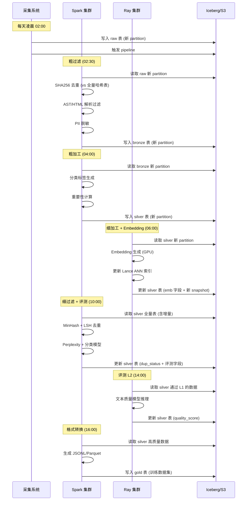

# 全链路处理阶段——详细设计

> 主文档：[README.md](../README.md) 第 4 章

---

## 目录

- [1. 全链路数据流总览](#1-全链路数据流总览)
- [2. 阶段一：数据采集](#2-阶段一数据采集)
- [3. 阶段二：粗过滤（规则引擎）](#3-阶段二粗过滤规则引擎)
- [4. 阶段三：粗加工（元数据打标）](#4-阶段三粗加工元数据打标)
- [5. 阶段四：细加工（Embedding 生成 + 多级索引）](#5-阶段四细加工embedding-生成--多级索引)
- [6. 阶段五：细过滤（去重）](#6-阶段五细过滤去重)
- [7. 阶段六：数据评测（分层漏斗）](#7-阶段六数据评测分层漏斗)
- [8. 阶段七：格式转换（最终产出）](#8-阶段七格式转换最终产出)
- [9. 增量数据合并策略](#9-增量数据合并策略)
- [10. 各数据源的差异化处理路径](#10-各数据源的差异化处理路径)
- [11. 各阶段数据 Schema 定义](#11-各阶段数据-schema-定义)

---

## 1. 全链路数据流总览

```
                    ┌──────────┐
                    │ 数据采集  │  阶段一：原始数据入湖
                    └────┬─────┘
                         ↓
                    ┌──────────┐
                    │ 粗过滤    │  阶段二：规则引擎，丢弃明确不可用数据
                    └────┬─────┘
                         ↓
                    ┌──────────┐
                    │ 粗加工    │  阶段三：元数据打标（分类/标签/hash/来源/重要性）
                    └────┬─────┘
                         ↓
                    ┌──────────┐
                    │ 细加工    │  阶段四：Embedding 生成 + 多级 ANN 索引
                    └────┬─────┘
                         ↓
                    ┌──────────┐
                    │ 细过滤    │  阶段五：MinHash + LSH 去重（文档级）
                    └────┬─────┘
                         ↓
                    ┌──────────┐
                    │ 数据评测  │  阶段六：分层漏斗（Perplexity → 质量模型 → LLM Judge → 人工）
                    └────┬─────┘
                         ↓
                    ┌──────────┐
                    │ 格式转换  │  阶段七：训练可用格式输出
                    └────┬─────┘
                         ↓
                    ┌──────────┐
                    │ 数据配比  │  训练团队动态调整，非数据链路阶段
                    └──────────┘
```

**每个阶段的存储都是 Iceberg 的一个独立`snapshot`。**
下游阶段读取上游 `snapshot`，处理后写入自己的 `snapshot`。这让全链路具备完整的时间旅行和血缘追溯能力。

---

## 2. 阶段一：数据采集

### 2.1 四条采集通道

| 通道 | 采集方式 | 原始存储格式 | 预估规模 |
|---|---|---|---|
| **GitHub 静态快照** | GitHub Archive + API，下载 master/main 分支文件树 | 文件系统原始格式（`.py` `.js` `.java` 等） | PB 级 |
| **GitHub 演进式挖掘** | Clone 精选 repo，解析 git log + diff | 文件系统 + git 元数据 | TB 级（仅精选 repo） |
| **网页文档** | 爬虫集群（Scrapy/Playwright），定向深挖 + 通用抓取，隔离存储 | HTML 原始文件 + WARC 存档 | 10-100PB 级 |
| **API 文档** | 定向抓取 Swagger/OpenAPI/ReadTheDocs/MDN | HTML + JSON（结构化提取后） | TB 级 |

### 2.2 采集后原始存储

所有原始数据统一写入数据湖的 **`raw` schema** 下，按数据源分表：

```
s3://bucket/raw/
  ├── github_static/        -- Iceberg 表，每天一个分区
  │   ├── data/
  │   └── metadata/
  ├── github_evolution/     -- Iceberg 表，仅精选 repo
  ├── web_directed/         -- 定向深挖
  ├── web_general/          -- 通用抓取
  ├── api_doc/              -- API 文档
  └── github_issue_pr/      -- Issue/PR/Discussion
```

每个原始表存储两个核心字段：
- `id`: UUID，唯一标识
- `content`: 原始内容（文本/HTML/结构化的文本）
- `raw_metadata`: 采集时附带的元数据（URL、采集时间戳、源信息等）

**原始数据不可修改、不直接暴露给后续处理。** 后续阶段通过 snapshot 读取 `raw` 表。

### 2.3 关键设计决策

- **GitHub 不存完整 git history**：仅静态快照保留文件内容，完整 history（git log + diff）仅在"演进式挖掘"通道中按 repo 单独存储
- **网页 WARC 存档是合规底线**：避免未来无法复现原始内容，便于法务审查
- **定向抓取与通用抓取严格隔离**：不同 Iceberg 表，避免种子 URL 泄露到通用抓取的"噪声"中
- **采集即打 `source` 标签**：在 `raw_metadata` 中明确记录 `source` 字段，避免后续阶段混淆来源

---

## 3. 阶段二：粗过滤（规则引擎）

### 3.1 设计原则

- **纯规则引擎，不做任何 ML 推理**，保证成本可控、延迟可预测
- **快速丢弃明确不可用的数据**：格式错误、明显重复、低质量不可读、含 PII
- **宁可漏杀，不可误杀**：高召回策略——不确定的数据放行，后续阶段过滤

### 3.2 四条过滤规则详解

#### 规则 1：格式错误检测

| 数据类型 | 判断方式 | 阈值 | 动作 |
|---|---|---|---|
| **代码（Top-15 语言）** | Tree-sitter AST 解析 | 解析成功率 = 0（完全不可解析） | 丢弃 |
| **代码（其余语言）** | UTF-8 编码有效性 | 非有效 UTF-8 | 丢弃 |
| **HTML 网页** | HTML parser（如 selectolax/BeautifulSoup）解析后提取文本 | 有效文本占比 < 5% 或文本长度 < 50 字符 | 丢弃 |
| **Markdown 文档** | markdown-it / mistletoe 解析 | 无法解析为有效 AST | 丢弃 |
| **JSON/YAML** | 对应 parser 解析 | 格式不合法 | 丢弃 |

**不丢弃但打标的情况**：
- 代码 AST 解析部分失败（解析成功率 < 80% 但 > 0）：放行，但标记 `quality_level = partial_parse`
- HTML 文本占比 5-10%：放行，但标记 `quality_level = low_text_ratio`

#### 规则 2：精确哈希去重（第一层去重）

```
对每条已存在的数据：
  1. 计算 content 的 SHA256
  2. 在全量 SHA256 哈希表中查重
  3. 如果命中 → 丢弃新数据（或者保留旧数据、记录重复关系）
```

**哈希表实现**：
- 使用 Bloom Filter 做快速预判（减少 SHA256 全表扫描）
- 精确匹配使用 Iceberg 表自带的索引 + Spark broadcast join

**去重粒度**：文档级（整篇文档/整个文件），不做 chunk 级精确去重

#### 规则 3：低质量不可读检测

| 数据类型 | 检测维度 | 阈值 | 动作 |
|---|---|---|---|
| **代码** | 有效函数数 / 总行数 | 有效函数 = 0 | 丢弃 |
| **代码** | 注释密度 | 注释行数 / 总行数 < 1% 且文件 > 500 行 | 记录但不丢弃（可能是自动生成代码） |
| **代码** | 函数体平均行数 | 函数体平均 < 3 行且函数数 > 10 | 丢弃（无意义的 stub 文件） |
| **代码** | 重复行占比 | 重复行 / 总行数 > 80% | 丢弃（高度模板化的代码） |
| **文档** | 有效 token 数 | token < 100（使用轻量 tokenizer 估算） | 丢弃 |
| **网页** | 导航/模板页检测 | 含大量 `<nav>`, `<footer>`, 链接文本占比 > 50% | 丢弃 |
| **Issue/PR** | 模板检测 | 正文仅含自动填充模板，无用户原创内容 | 丢弃 |
| **Issue/PR** | Bot 内容 | 来自 bot 账号（github-actions, dependabot 等） | 丢弃 |

#### 规则 4：PII 脱敏

**必须在粗过滤阶段完成，进入下游前数据已脱敏。**

| PII 类型 | 检测方式 | 处理方式 |
|---|---|---|
| 邮箱 | 正则 `[\w\.-]+@[\w\.-]+\.\w+` | 替换为 `[EMAIL]` |
| 手机号 | 正则（国际 + 国内格式） | 替换为 `[PHONE]` |
| IP 地址 | 正则 IPv4/IPv6 | 替换为 `[IP]` |
| API Key / Token | 正则（常见格式：`sk-`, `ghp_`, `xoxb-` 等） | 替换为 `[API_KEY]` |
| 私钥 | 正则（`BEGIN.*PRIVATE KEY`） | 替换为 `[PRIVATE_KEY]` |
| 身份证号 / SSN | 正则 + 校验位验证 | 替换为 `[ID_NUMBER]` |
| 姓名 / 地址 | NER 模型（轻量，如 spaCy 预训练模型） | 替换为 `[PERSON]` / `[LOCATION]` |

**PII 脱敏日志**：每替换一处 PII，记录 `(document_id, detection_type, position, original_length)` 到审计日志表，但不存储原始 PII 值。

### 3.3 输出格式

粗过滤输出到 Iceberg 表 `bronze`（对应数据湖的 bronze 层）：

```
s3://bucket/bronze/
  ├── github_code/
  ├── github_issue_pr/
  ├── web_doc/
  └── api_doc/
```

**输出数据格式**：

| 字段 | 类型 | 说明 |
|---|---|---|
| `id` | UUID | 继承原始 ID |
| `content` | string | 脱敏后的文本内容 |
| `char_length` | int | 字符数 |
| `token_count` | int | 估算 token 数 |
| `lang` | string | 检测出的语言（代码语言 / zh / en / multilingual） |
| `raw_url` | string | 原始 URL（来源追溯） |
| `pii_audit` | JSON | PII 脱敏审计日志（类型 + 位置，不含原始值） |
| `pass_rule1` | bool | 格式检查是否通过 |
| `pass_rule2` | bool | 去重是否通过（新数据为 True） |
| `pass_rule3` | bool | 质量检查是否通过 |
| `pass_rule4` | bool | PII 脱敏是否已完成 |
| `filtered_at` | timestamp | 过滤时间戳 |

---

## 4. 阶段三：粗加工（元数据打标）

### 4.1 设计原则

- **元数据是下游检索和配比的"方向盘"**，全部在粗加工阶段统一建立
- **控制元数据膨胀**：embedding 限 1-2 个，分类 tag 限 ≤ 10 个
- **可置空字段不影响下游**：`quality_level`、`importance`、`license` 均可为 NULL，下游按 NULL-safe 方式消费

### 4.2 元数据字段定义

| 字段 | 数据类型 | 枚举值 / 范围 | 生成方式 | 是否可置空 |
|---|---|---|---|---|
| `id` | UUID | — | 继承 | 否 |
| `source` | enum | `github` / `web_crawl` / `api_doc` / `curated` | 从采集阶段继承 | 否 |
| `content_type` | enum | `code` / `natural_text` / `structured` / `mixed` | 规则判断 | 否 |
| `lang` | enum | `zh` / `en` / `multilingual` / `code` | 语言检测模型（fastText / langdetect） | 否 |
| `lang_detail` | string | 具体语言名（`python` / `javascript` / `markdown` 等） | Tree-sitter / 规则 | 否 |
| `quality_level` | enum | `raw` / `filtered` / `high_potential` | 基于粗过滤结果填充 | 可（初始为 `raw`） |
| `importance` | float | 0.0 - 1.0 | A（来源权威分）× B（内容密度分） | 可（未知来源 = NULL） |
| `hash` | string（SHA256 hex） | 64 字符 | SHA256(content) | 否 |
| `license` | string | `MIT` / `Apache-2.0` / `GPL-3.0` / `BSD-3` / ... | GitHub API + 文件头解析 | 可 |
| `char_length` | int | — | len(content) | 否 |
| `token_count` | int | — | 轻量 tokenizer 估算 | 否 |
| `url` | string | http(s) URL | 原始来源 URL | 可 |
| `fetch_ts` | timestamp | ISO 8601 | 采集时间戳 | 否 |
| `tags` | JSON array | ≤ 10 个，如 `["tutorial", "reference"]` | 后续与训练团队确定 | 可 |
| `metadata_json` | JSON | 扩展字段 | 预留，暂不填充 | 可 |

### 4.3 重要性（importance）计算细则

```
importance = authority_score × density_score

authority_score（来源权威分）：
  GitHub repo ≥ 10000 stars  → 1.0
  GitHub repo ≥ 1000 stars   → 0.8
  GitHub repo ≥ 100 stars    → 0.6
  GitHub repo < 100 stars    → 0.4
  官方文档（Python.org, MDN, kubernetes.io 等） → 1.0
  知名技术博客/论坛                        → 0.7
  通用网页                                → 0.5
  未知来源                                → NULL（不参与计算）

density_score（内容密度分）：
  min(token_count / char_length / 4, 1.0)  -- "4" 是中英文混合的每 token 约 4 字符估算
  如果 content_type = code：
    有效代码行数 / 总行数（去空行、纯注释行）
  如果 content_type = natural_text：
    有效段落数 × 平均段落长度 / 总 token 数的幂函数归一化
```

**注意**：`importance` 是粗加工阶段的初步评分，后续评测阶段会生成更精确的质量分。粗加工阶段的 importance 主要用于：
1. 下游处理阶段优先分配 GPU/CPU 资源给高 importance 数据
2. 数据配比时作为初始权重参考

### 4.4 输出格式

粗加工输出到 Iceberg 表 `silver`（对应数据湖的 silver 层）：

```
s3://bucket/silver/
  └── all_sources/    -- 所有数据源合并为一张表
```

**此时所有数据源不分表存储**，因为大类标签（`source`, `content_type`, `lang`）已经足够区分。

---

## 5. 阶段四：细加工（Embedding 生成 + 多级索引）

### 5.1 多级索引架构

```
                     ┌─────────────────┐
                     │  路由层          │
                     │  (source × lang) │
                     └──┬──────┬───────┘
                        │      │
           ┌────────────┘      └────────────┐
           ↓                                ↓
   ┌───────────────┐                ┌───────────────┐
   │ github_code   │                │ web_doc_en    │
   │ (簇1)         │                │ (簇2)          │
   │ ANN 索引 1    │                │ ANN 索引 2     │
   └───────────────┘                └───────────────┘
           ↓                                ↓
   ┌───────────────┐                ┌───────────────┐
   │ 存入 Lance     │                │ 存入 Lance     │
   │ (content_emb  │                │ (content_emb  │
   │  + ANN idx)   │                │  + ANN idx)   │
   └───────────────┘                └───────────────┘
```

路由规则（从粗到细）：

```
路由层级:
  1. source（数据来源）     → github / web_crawl / api_doc / curated
  2. content_type（内容类型） → code / natural_text / structured / mixed
  3. lang（语言）           → zh / en / multilingual / code
```

**每个簇内独立建 ANN 索引**，避免不同语义空间的数据互相干扰。

### 5.2 两阶段 Embedding 策略

| 阶段 | 模型 | 维度 | 对象 | 目标 | 框架 |
|---|---|---|---|---|---|
| **Phase 1** | 轻量模型（all-MiniLM-L6-v2 / BGE-small-en） | 384d | 全量数据 | 高召回，快速建立可用索引 | Ray |
| **Phase 2** | 中等模型（BGE-base / E5-base / GTE-base） | 768d/1024d | 高价值子集（高 importance + 高频检索命中的） | 高精度语义检索 | Ray |

**代码数据专用**：代码簇可选用代码专用模型（UniXcoder / StarCoder-Embed），"code" 类型的 lang 走这个分支。

### 5.3 Embedding 生成后的索引

每条数据 1-2 个 embedding：

```
content_embedding    -- 原始内容语义向量（必选）
summary_embedding    -- 摘要语义向量（可选，仅当 content > 2000 tokens 时生成）
```

**索引存储**：
- Embedding 向量存入 Lance 格式的列（`content_emb`, `summary_emb`）
- 利用 Lance 的 `create_index()` API 在每个簇上建 IVF-PQ 或 DiskANN 索引
- 索引与数据存在同一个 Lance dataset 中，无需独立向量数据库

### 5.4 计算框架选型：Ray

```
伪代码流程:
  1. Ray 从 Iceberg silver 表读取数据
  2. 按 (source, content_type, lang) 分组，每组一个 Ray Task
  3. 每个 Task 内:
     a. 加载对应 embedding 模型（轻量/代码专用）
     b. 批处理生成 embedding（batch_size = 256-512，利用 GPU 批处理）
     c. 写入 Lance dataset，建索引
  4. 更新 Iceberg silver 表 → silver_with_emb 的 snapshot
```

---

## 6. 阶段五：细过滤（去重）

### 6.1 三层级联去重

```
┌──────────────────────────────────────────────┐
│ 第 1 层：SHA256 精确哈希（已在粗过滤阶段完成）   │
│ 输入：全量  输出：去除完全相同的数据               │
│ 状态：✅ 已完成                                  │
└──────────────────────────────────────────────┘
                      ↓
┌──────────────────────────────────────────────┐
│ 第 2 层：MinHash + LSH（细过滤阶段执行）          │
│ 输入：经粗过滤后的数据                            │
│ 做法：                                           │
│   1. 对每条文档生成 MinHash 签名（128/256 个哈希）  │
│   2. LSH 分桶，桶内计算 Jaccard 相似度              │
│   3. Jaccard ≥ 0.8 视为近重复                     │
│   4. 保留 importance 最高的那条，其余标记为 dup     │
│ 粒度：文档级（整篇文档）                            │
│ 框架：Spark（MinHash 计算 + LSH 索引）              │
└──────────────────────────────────────────────┘
                      ↓
┌──────────────────────────────────────────────┐
│ 第 3 层：Embedding 语义去重（Phase 2 启用）        │
│ 输入：高价值数据配比子集                           │
│ 做法：                                           │
│   1. 在同一个簇内，用 ANN 检索 top-K 最近邻          │
│   2. 余弦相似度 ≥ 0.95 视为语义重复                 │
│   3. 保留 importance 最高的一条                    │
│ 粒度：文档级                                      │
│ 框架：Lance ANN 索引查询                          │
│ ⚠️ Phase 1 暂不启用                              │
└──────────────────────────────────────────────┘
```

### 6.2 MinHash + LSH 详细参数

| 参数 | 推荐值 | 说明 |
|---|---|---|
| MinHash 签名长度 | 128 | 平衡精度和存储 |
| LSH 桶数（bands） | 16 | 每 band 8 个哈希 |
| Jaccard 阈值 | 0.8 | ≥ 0.8 判为近重复 |
| n-gram 大小 | 3（代码）/ 5（文档） | 代码用字符 3-gram，文档用词 5-gram |

### 6.3 去重结果存储

去重后的数据标记为两类：

| status | 含义 | 后续处理 |
|---|---|---|
| `unique` | 非重复数据 | 正常进入下游 |
| `dup` | 被判定为重复 | 不删除，标记 `dup_status = dup` + `dup_of = 保留条目的 ID`，保留在 Iceberg 中供复查 |

**不物理删除重复数据**：为保证全链路可追溯，所有数据（包括被判定为重复的）都在 Iceberg 中保留，通过 `dup_status` 字段区分。

---

## 7. 阶段六：数据评测（分层漏斗）

### 7.1 为什么数据评测是整个链路的核心

数据评测不是"最后一道检查"，而是**质量决策的中枢**：

1. **上游反馈**：评测结果反馈给粗过滤/粗加工，校准过滤阈值
2. **下游保障**：评测质量分是数据配比的依据，直接影响训练效果
3. **成本优化**：通过漏斗逐级筛选，避免在低质量数据上浪费 LLM Judge 和人工评估资源
4. **漂移预警**：评测分的时间序列变化是最敏感的漂移信号

### 7.2 四层漏斗详细设计

```
                  ┌──────────────────────────┐
  100% 数据 ─────→│  L1: Perplexity + 分类模型  │ 成本: $
                  │  输出: PPL 分 + 分类置信度   │
                  └────────────┬─────────────┘
                    通过 L1 的数据 (~80%)
                               ↓
                  ┌──────────────────────────┐
                  │  L2: 文本质量模型           │ 成本: $$
                  │  (fine-tuned BERT/RoBERTa) │
                  │  输出: 质量分 0-100         │
                  └────────────┬─────────────┘
                    通过 L2 的数据 (~60%)
                               ↓
                  ┌──────────────────────────┐
                  │  L3: LLM Judge (抽样 N 条)  │ 成本: $$$
                  │  用于校准 L1/L2 阈值        │
                  │  不直接过滤全量数据          │
                  └────────────┬─────────────┘
                               ↓
                  ┌──────────────────────────┐
                  │  L4: 人工评估 (最小量)      │ 成本: $$$$
                  │  最终 QA 基准锚定           │
                  │  校准 LLM Judge 的偏差      │
                  └──────────────────────────┘
```

#### L1 层：Perplexity + 分类模型（全量，纯推理）

| 组件 | 模型 | 用途 | 输出 |
|---|---|---|---|
| Perplexity 评估 | KenLM n-gram 模型（5-gram），分别在中文/英文/代码语料上训练 | 评估文本"自然度"，PPL 极高 = 乱码/非自然文本 | `ppl_score`（越低越好） |
| 分类模型 | 轻量文本分类模型（DistilBERT fine-tuned） | 判断内容类型（代码/文档/对话/噪声/其他） | `class_pred` + `class_confidence` |

**L1 过滤逻辑**：
```
if ppl_score > ppl_threshold AND class_pred == "noise":
    quality_status = "L1_LOW"
elif class_confidence < 0.5:
    quality_status = "L1_UNCERTAIN"
else:
    quality_status = "L1_PASS"
```

**L1 计算框架**：Spark（CPU），批量推理，不消耗 GPU。

#### L2 层：文本质量模型（通过 L1 的候选集）

| 模型 | 训练方式 | 判断维度 |
|---|---|---|
| RoBERTa-base / DeBERTa-v3 | 在人工标注的 (高质量, 低质量) 二分类数据上 fine-tune | 语法完整性、信息密度、语义连贯性、是否为模板/生成内容 |

**L2 输出**：`quality_score`（0-100 连续值，越高越好）

**L2 不设硬阈值**：`quality_score` 作为连续字段存入元数据，具体阈值由训练团队配比时决定。

**L2 计算框架**：Ray（GPU），批量推理。

#### L3 层：LLM Judge 校准（抽样）

**目的**：自动校准 L1 和 L2 的阈值，让机器评测与人的判断对齐。

**流程**：
```
1. 抽样：从 L1/L2 通过的数据中分层随机抽取 N=2000 条
   - 层1: quality_score 0-20  (500 条)
   - 层2: quality_score 20-40 (500 条)
   - 层3: quality_score 40-60 (500 条)
   - 层4: quality_score 60-80 (500 条)
   - 层5: quality_score 80-100(500 条)

2. LLM Judge 打分：
   使用内部部署的强模型（如内部 70B 模型），统一 prompt：
   "请从以下维度给这段数据打分(1-5)：
    - 信息密度：内容是否充实、有价值
    - 可读性：语言是否流畅、格式是否规范
    - 正确性：代码/信息是否明显有误
    - 教育价值：对模型训练是否有帮助"

3. 人工校验（同 N 条）：由标注团队对同一批数据打分

4. ROC 曲线校准：
   - 将 LLM Judge 的评分二值化（≥4 = "高质量"）
   - 对比人工标注，计算 ROC
   - 找 Youden 指数最优阈值
   - 该阈值反馈给 L1 和 L2 做全量过滤

5. 迭代：每两周重新抽样校准一次
```

**LLM Judge 不用于全量过滤**：它只用于抽样校准，成本控制。

#### L4 层：人工评估（锚定）

**目的**：定期校准 LLM Judge 和自动评测的偏差。

| 维度 | 方案 |
|---|---|
| 频率 | 每两周一次 |
| 样本量 | 200-500 条/次 |
| 标注人员 | 2-3 人交叉标注 |
| 标注维度 | 信息密度 / 可读性 / 正确性 / 教育价值（1-5 分） |
| 产出 | 标注一致性（Kappa 系数）+ LLM Judge 偏差报告 |

### 7.3 评测结果在元数据中的存储

```
quality_status:  enum  -- "L1_LOW" / "L1_UNCERTAIN" / "L1_PASS" / "L2_PASS" / "L3_VERIFIED"
quality_score:   float -- 0-100（L2 产出）
ppl_score:       float -- Perplexity 值（L1 产出）
class_pred:      string -- 分类预测（L1 产出）
llm_judge_score: float -- LLM Judge 评分（仅抽样数据）
human_score:     float -- 人工评分（仅抽样数据）
evaluated_at:    timestamp -- 评测时间戳
```

---

## 8. 阶段七：格式转换（最终产出）

### 8.1 最终给模型的数据格式

这是数据链路的最终交付物，直接供训练框架消费。

#### 预训练数据格式

```
格式：JSONL（每行一条数据记录）
文件名：{split}_{source}_{quality_level}_{timestamp}.jsonl
```

每条记录的结构：

```json
{
  "id": "uuid-v4",
  "text": "脱敏后的原始文本内容...",
  "meta": {
    "source": "github",
    "content_type": "code",
    "lang": "python",
    "quality_score": 85.3,
    "importance": 0.72,
    "hash": "abc123...",
    "tags": ["algorithms", "data_structure"],
    "url": "https://github.com/xxx/yyy/blob/main/zzz.py",
    "license": "MIT",
    "pipeline_version": "v1.2.3",
    "snapshot_id": "snap_20240615_001"
  }
}
```

**关键决策：不预 tokenize**。原因：

- Phase 1 阶段 tokenizer/BPE 词表大概率会迭代，预 tokenize 按需全量重跑代价巨大
- 现代训练框架（Megatron/NeMo/FSDP）的在线 tokenize + 预取流水线已很成熟，GPU 利用率损耗 < 3%
- 原始文本存储具备可读性和可调试性，token ids 不可人类阅读
- 详见 [README.md](../README.md) 第 9.2 节 Token 预计算对比

#### SFT / Instruction 数据格式

如果有合成数据或从 GitHub 挖掘的 instruction 数据，单独用标准格式输出：

```
格式：Parquet 列式存储
列：
  - instruction: string
  - input: string (可为空)
  - output: string
  - system: string (可为空)
  - history: list<dict> (可为空)
  - meta: JSON (来源、质量分、许可证等元数据)
```

### 8.2 数据集分割策略

| 分割 | 占比 | 说明 |
|---|---|---|
| `train` | 90-95% | 训练集 |
| `validation` | 5-10% | 验证集，评估训练过程中 loss/perplexity |
| `test` | 按需 | 由训练团队自己划分或使用标准 benchmark，数据链路不负责 |

### 8.3 格式转换的正确性校验

每次输出数据集之前自动执行：

```python
def validate_output_dataset(dataset_path):
    """数据集正确性校验"""
    assert all(text is not None for text in dataset), "存在空文本"
    assert all(len(text) > 0 for text in dataset), "存在零长度文本"
    assert all(meta["source"] in ["github", "web_crawl", "api_doc", "curated"]), "未知 source"
    assert all(meta["quality_score"] >= 0), "质量分为负"
    assert len(set(meta["hash"])) == len(dataset), "存在重复哈希（去重失败）"
    assert all_no_pii(dataset), "PII 未完全脱敏"
    # ... 更多校验项
```

---

## 9. 增量数据合并策略

### 9.1 策略概述：追加式 + 定期 Compaction

```
天级增量数据:
  ├── 新数据独立处理（走完整 1-7 阶段流水线）
  ├── 写入新的 partition（按日期分区）
  ├── 不触碰已处理的历史数据
  └── 去重/合并延迟到读阶段或定期 Compaction

冷热分层:
  热数据（近 30 天）→ 追加式写入，快速可用
  冷数据（> 30 天）→ 定期 Compaction 合并小文件、重建索引
```

### 9.2 增量处理流程

```
每天定时触发:
  1. 从 raw 表读取过去 24 小时的新数据（增量）
  2. 依次通过阶段 2-7 的流水线
  3. 写入对应 Iceberg 表的当天分区
  4. 更新 Iceberg snapshot

去重处理:
  第 1 层（SHA256）: 增量数据 vs 全量哈希表，实时完成
  第 2 层（MinHash+LSH）: 增量数据 vs 已有 LSH 索引，天级延迟可接受
  第 3 层（语义去重）: Phase 2 启用，按需触发

元数据统一:
  所有阶段的元数据通过 Iceberg snapshot ID 关联
  增量数据和历史数据共享同一个元数据表（Iceberg manifest）
```

### 9.3 Compaction 策略

| 触发条件 | 操作 | 时间窗口 |
|---|---|---|
| 每日小合并 | 合并当天产生的零碎小文件 | 每天凌晨自动 |
| 每周中合并 | 合并过去 7 天的分区 | 每周日凌晨 |
| 每月大合并 | 将 30 天以上的热数据转为冷数据分区，重建 LSH 索引 | 每月第一个周日 |

**Compaction 不阻塞读取**：Iceberg 的 snapshot 隔离保证 Compaction 期间下游读不受影响。

### 9.4 数据重处理与回溯

当粗过滤/粗加工/评测的规则或模型升级时，需要对历史数据重新处理：

```
重处理流程:
  1. 从指定的 Iceberg snapshot 读取数据
  2. 重新运行目标阶段及所有下游阶段
  3. 生成新的 snapshot
  4. 旧 snapshot 保留（time travel），新 snapshot 成为当前版本
  5. 通知下游消费者（训练团队）数据版本已更新
```

**重处理触发条件**：
- PII 脱敏规则升级
- 去重阈值调整
- 分类/标签体系变更
- 质量模型升级

---

## 10. 各数据源的差异化处理路径

并非所有数据源都走完全相同的处理阶段。以下区分各数据源在每个阶段的差异：

### 10.1 GitHub 代码数据

```
采集 → 粗过滤 → 粗加工 → 细加工 → 细过滤 → 评测 → 格式转换
                    ↓              ↓
              AST 解析过滤   代码专用 embedding 模型
              License 解析   独立簇建索引
              PII 深度清洗

特殊处理:
  - 粗过滤: AST 解析成功率判定 + 函数粒度质量检测
  - 粗加工: 解析 License（文件头 + repo LICENSE 文件）
  - 细加工: 代码专用 embedding（UniXcoder/StarCoder-Embed）
  - 细过滤: 代码去重用字符 3-gram MinHash（非词 5-gram）
  - 评测: Perplexity 模型需在代码语料上单独训练
```

### 10.2 网页文档数据

```
采集 → 粗过滤 → 粗加工 → 细加工 → 细过滤 → 评测 → 格式转换
         ↓
  HTML → 文本提取（boilerplate removal）
  导航/广告页过滤

特殊处理:
  - 粗过滤: HTML 解析后提取有效文本，过滤导航页、广告页、登录页
  - 粗加工: 网页审美（DOM 特征）作为备用质量信号（Phase 2 探索项）
  - 细加工: 通用文本 embedding 模型
  - 细过滤: 文档去重用词 5-gram MinHash
  - 评测: L1 的语言检测更严格（多语言网页的质量方差大）
```

### 10.3 API 文档数据

```
采集 → 粗过滤 → 粗加工 → 细加工 → ─────→ 评测 → 格式转换
         ↓              ↓
  结构化提取      (api_name, api_module,
  (函数签名/        doc_text, code_snippet)
  参数表格)        存入元数据
                     ↓
              API-代码对齐关联
              (并行子模块，非主链路)

特殊处理:
  - 粗过滤: 结构化提取 function signature / parameter table / return type
  - 粗加工: 存入 (api_name, doc_text) 对，准备对齐
  - API-代码对齐: 倒排索引 + AST 验证 → 存入 metadata 作为关联关系
```

### 10.4 GitHub Issue/PR/Discussion

```
采集 → 粗过滤 → 粗加工 → 细加工 → 细过滤 → 评测 → 格式转换
         ↓
  Bot 内容过滤
  模板检测
  Issue-PR 关联

特殊处理:
  - 粗过滤: 强规则过滤 bot 内容、空模板、低质量短回复
  - 粗加工: 关联 Issue 和对应的 PR（如果有）
  - 细加工: 通用文本 embedding
  - 评测: L1 更关注"对话质量"而非单纯文本质量
```

---

## 11. 各阶段数据 Schema 定义

### 11.1 Raw 层（采集后）

| 字段 | 类型 | 说明 |
|---|---|---|
| `id` | UUID | 全局唯一标识 |
| `content` | binary/bytes | 原始文件内容（未被修改） |
| `source` | string | 数据来源通道 |
| `url` | string | 原始 URL |
| `fetch_ts` | timestamp | 采集时间戳 |

### 11.2 Bronze 层（粗过滤后）

| 字段 | 类型 | 说明 |
|---|---|---|
| `id` | UUID | 继承 |
| `content` | string | 脱敏后文本 |
| `char_length` | int | 字符数 |
| `token_count` | int | token 估算 |
| `lang` | string | 语言 |
| `raw_url` | string | 原始 URL |
| `pii_audit` | JSON | PII 脱敏审计日志 |
| `pass_rule1` | bool | 格式检查 |
| `pass_rule3` | bool | 质量检查 |
| `filtered_at` | timestamp | 过滤时间 |

### 11.3 Silver 层（粗加工 + 细加工后）

| 字段 | 类型 | 说明 |
|---|---|---|
| `id` | UUID | 继承 |
| `content` | string | 脱敏后文本 |
| `source` | enum | github / web_crawl / api_doc / curated |
| `content_type` | enum | code / natural_text / structured / mixed |
| `lang` | enum | zh / en / multilingual / code |
| `lang_detail` | string | 具体语言名 |
| `quality_level` | enum | raw / filtered / high_potential |
| `importance` | float | 0-1 |
| `hash` | string | SHA256 |
| `license` | string | 许可证 |
| `char_length` | int | 字符数 |
| `token_count` | int | token 数 |
| `url` | string | 来源 URL |
| `fetch_ts` | timestamp | 采集时间 |
| `tags` | JSON | 标签数组 |
| `content_emb` | list\<float\> | 内容 embedding（384d Phase 1） |
| `summary_emb` | list\<float\> | 摘要 embedding（可选） |
| `emb_model_version` | string | embedding 模型版本 |
| `dup_status` | enum | unique / dup / pending |
| `dup_of` | UUID | 重复于哪个条目 |
| `metadata_json` | JSON | 扩展元数据 |

### 11.4 Gold 层（评测后 + 格式转换）

| 字段 | 类型 | 说明 |
|---|---|---|
| `id` | UUID | 继承 |
| `content` | string | 脱敏后文本 |
| `meta` | JSON | 所有 silver 层字段 + 评测字段的合并 |

**Gold 层是最终给训练团队的交付物**，其中 `meta` 包含完整的、不可分割的元数据。训练团队按 `meta` 中的维度做配比、采样、过滤。

---

## 附录 A：处理阶段-数据源关系矩阵

| 阶段 | GitHub 代码 | 网页文档 | API 文档 | Issue/PR |
|---|---|---|---|---|
| 采集 | ✅ | ✅ | ✅ | ✅ |
| 粗过滤-格式检查 | AST 解析 | HTML→文本 | 结构化提取 | Markdown 解析 |
| 粗过滤-去重(SHA256) | ✅ | ✅ | ✅ | ✅ |
| 粗过滤-低质量 | 函数级检测 | 导航/广告过滤 | token 数+结构完整性 | Bot/模板检测 |
| 粗过滤-PII 脱敏 | ✅ | ✅ | ✅ | ✅ |
| 粗加工-分类 | ✅ | ✅ | ✅ | ✅ |
| 粗加工-重要性 | 按 stars | 按域名权威 | 按文档官方度 | 按 issue 活跃度 |
| 细加工-Embedding | 代码专用模型 | 文本通用模型 | 文本通用模型 | 文本通用模型 |
| 细加工-索引簇 | `github/code/*` | `web/*/*` | `api_doc/*/*` | `github/text/*` |
| 细过滤-MinHash | 字符 3-gram | 词 5-gram | 词 5-gram | 词 5-gram |
| 评测-L1 PPL | 代码 PPL 模型 | 中/英 PPL 模型 | 中/英 PPL 模型 | 对话 PPL 模型 |
| 评测-L2 | 代码质量模型 | 文本质量模型 | 文本质量模型 | 对话质量模型 |
| 评测-L3 LLM Judge | ✅（抽样） | ✅（抽样） | ✅（抽样） | ✅（抽样） |
| 格式转换 | 代码文本 | 文档文本 | 文档文本 | 对话文本 |
| API-代码对齐 | ✅（关联方） | — | ✅（关联方） | — |

---

## 附录 B：增量合并处理时序图



---

> **下一步**：各阶段的技术实现细节和伪代码见后续文档。